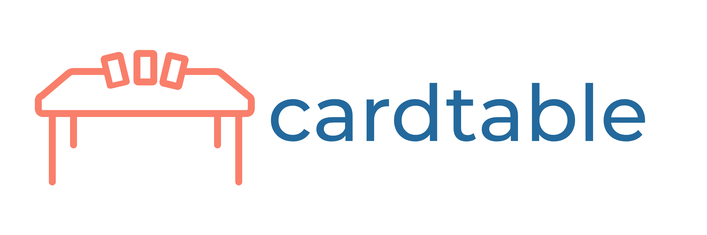

Hi Everyone! I'm super excited to be sharing publicly what has long been just a personal labor of love for me. I'm excited to share https://card-table.app with the amazing communities for the LOTR LCG and Marvel Champions LCG games.

Cardtable started life many years ago as a simple hobby project and a way for me to learn more about React and HTML5 canvases. Then, as the pandemic and isolation of the pandemic began in 2020, I realized a few things:

- I was going to be in my house looking for entertainment _way_ more often than I was used to
- I wanted to play Marvel Champions and LOTR LCG more
- Given that my kids were also around and constantly helping me "practice context switching", I needed to be able to set up games quickly
- My son was getting to the age where I could play with him, and I wanted a super easy and fun way to play with him without all the setup / tear down

Given my background as a software engineer, I decided I could build something that would solve my problems and be a fun technical challenge.

A lot of you in the community may know that there are existing ways to play these games digitaly: OCTGN, Tabletop Simulator, the awesome https://dragncards.com/ to name a few. However, none of these hit all the things _I_ wanted in a digital version:

- No need to install anything
- Could support multiple games
- Cross-platform
- Built from the ground up for mobile / touch support
- Offline play
- No need for a server (for single-player for sure)
- No need for a server (for multiplayer? Was this possible, I wondered?)

So these became my goals for my application. And I'm happy to say that I've achieved all of them to some degree!

After years of work, I'm excited to show off what I've been working on, and I just hope that it is as useful for you as it has been for me! I hope you'll excuse me as I work on some of the rough edges, and if you have any interest in helping, please reach out!
