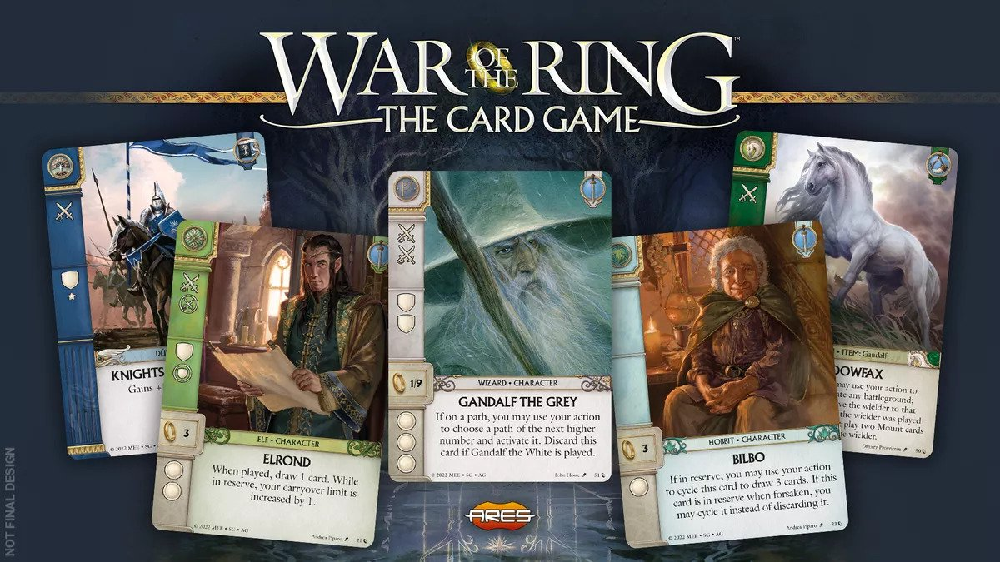

I'm super excited to share some information on a major new release for Cardtable! This release has several small feature changes, a few big "under-the-cover" changes, and a new game type available!

## New Game Support

Let's start with the big one - the new game! Cardtable now support `War of the Ring: The Card Game` by Ares games.

I absolutely adore the War of the Ring board game, and while I haven't played it as much, I already love the card game version!

In releasing another game on Cardtable, and a game that is structurally different from the other two LCGs, I had to make a lot of under-the-hood improvements, including things like:

- Supporting cards of different sizes
- Supporting free-standing-tokens that can be flipped
- Allowing for a counter with a specific icon
- Allowing for 4 different numeric counters on a card
- Having a more consistent way to create / load various game types

This took a good deal of effort, but ultimately should make it easier to add additional games in the future.

## New Multiplayer backend

In addition to the new game type, I've completely revamped the behind-the-scenes workings of multiplayer. For those of you technically inclined out there, I basically swapped from WebRTC to WebSockets. This means I had to implement a small web service to manage the websocket connections, but it also made some things easier (Hello 3 and 4 player multiplayer support!)

## New Features

There were also a lot of things that I fixed / updated across multiple games. Highlights include:

- Adding an acceleration token for Marvel Champions

- Changing how tokens are added / removed from a card. Now to add you use Cmd / Ctrl / Alt + 1, 2, 3, 4 to add values, and Shift + 1, 2, 3, 4 to remove values
