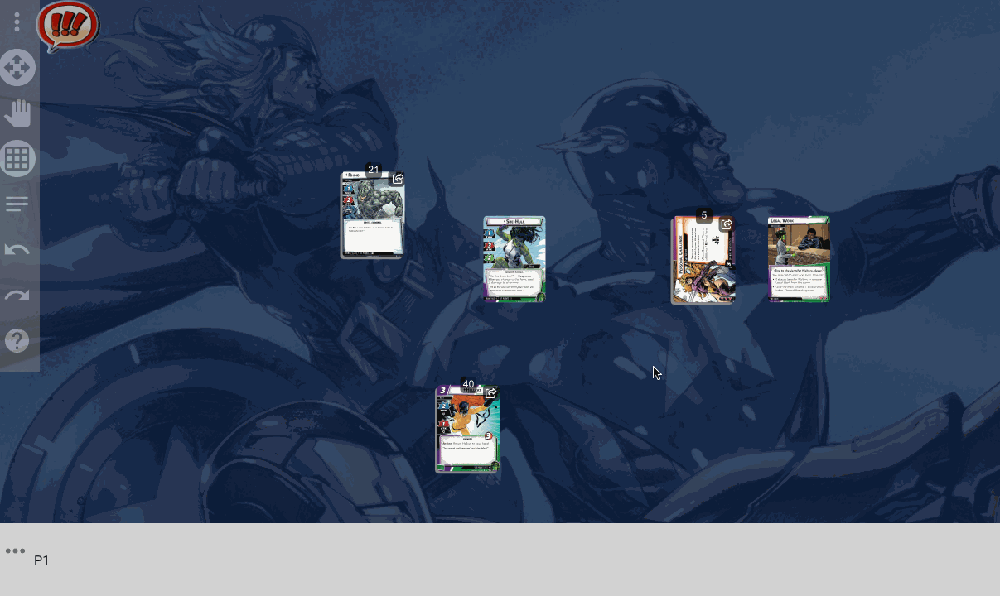
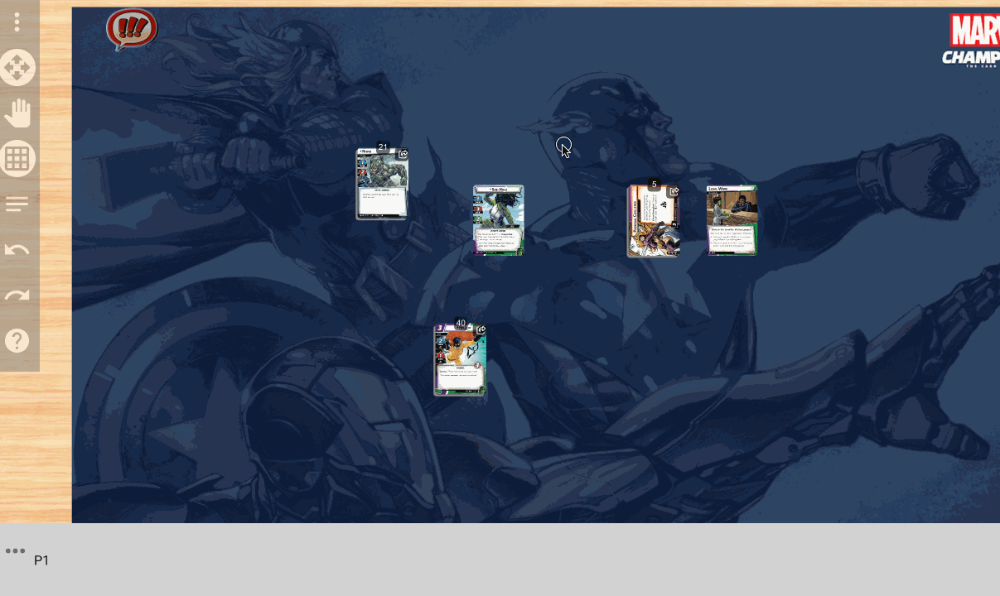

Hi all - I've been focusing on cleaning up some of the most common requests I've gotten for Cardtable, and today I'm releasing several of these changes! They include

## Exhaust All / Ready all

Now, if you select multiple cards, and some are exhausted and some are not, if you "Exhaust Cards" first all cards will become exhausted, then they will all ready

## Save / Load game

The most requested feature, you can now save your game to a file and load from a file!

## Pan even when not in pan mode

Now, if you hold the Cmd (Mac) or Ctrl (Windows) key, even when you are not in pan mode you can still pan the table!

## Reset / Quit confirmation

Just so you don't accidentally reset or quit a game, now there are confirmation dialogs in place for reset / quit!

Thanks everyone who has been using Cardtable, I love hearing everyone's feedback. 

And stay tuned, as a new game will be arriving out of testing soon......
