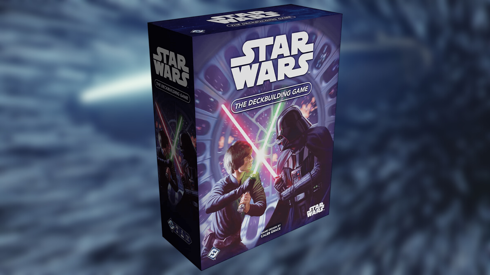
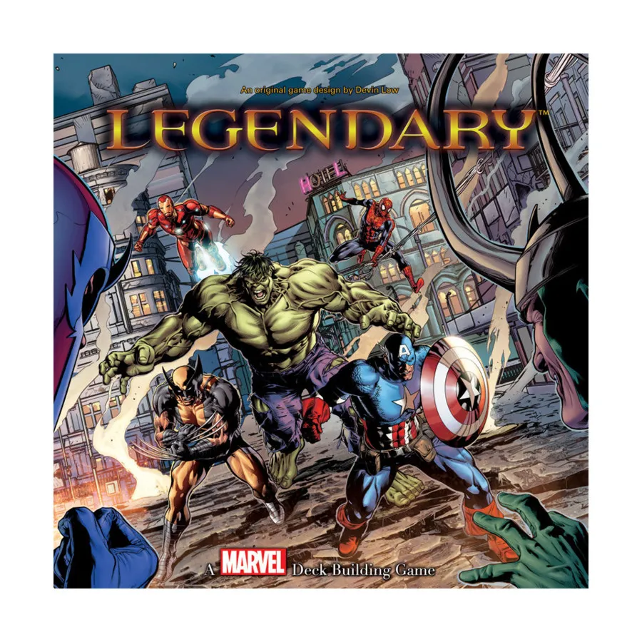
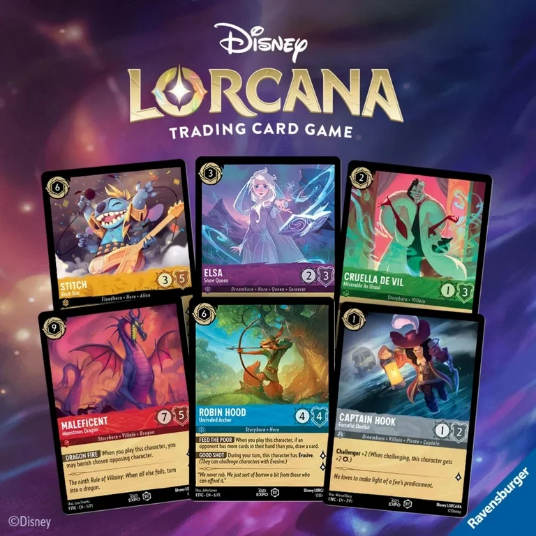
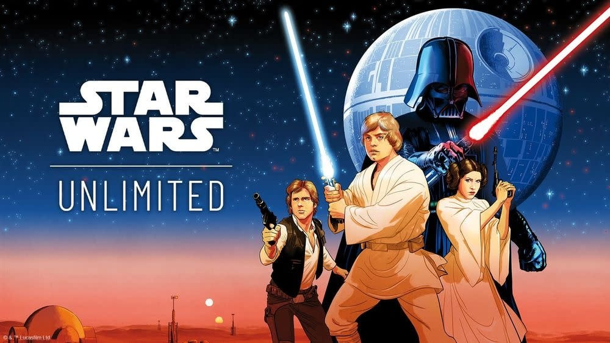
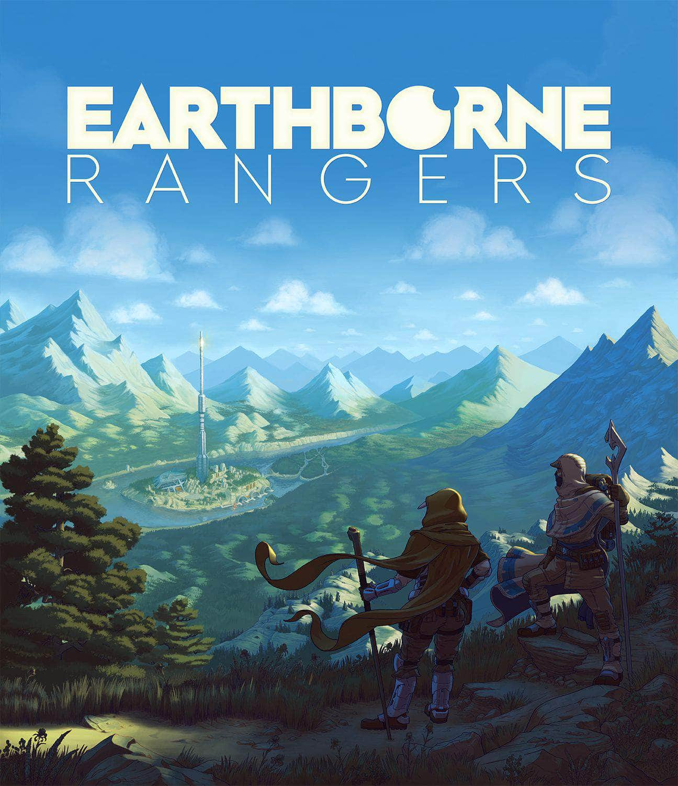
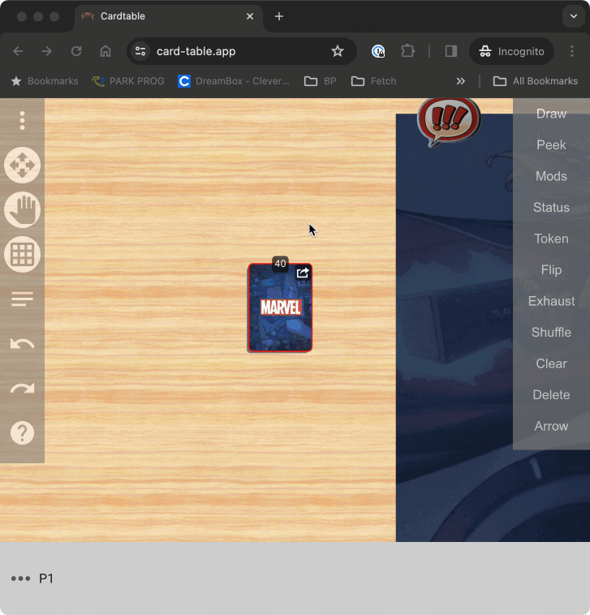
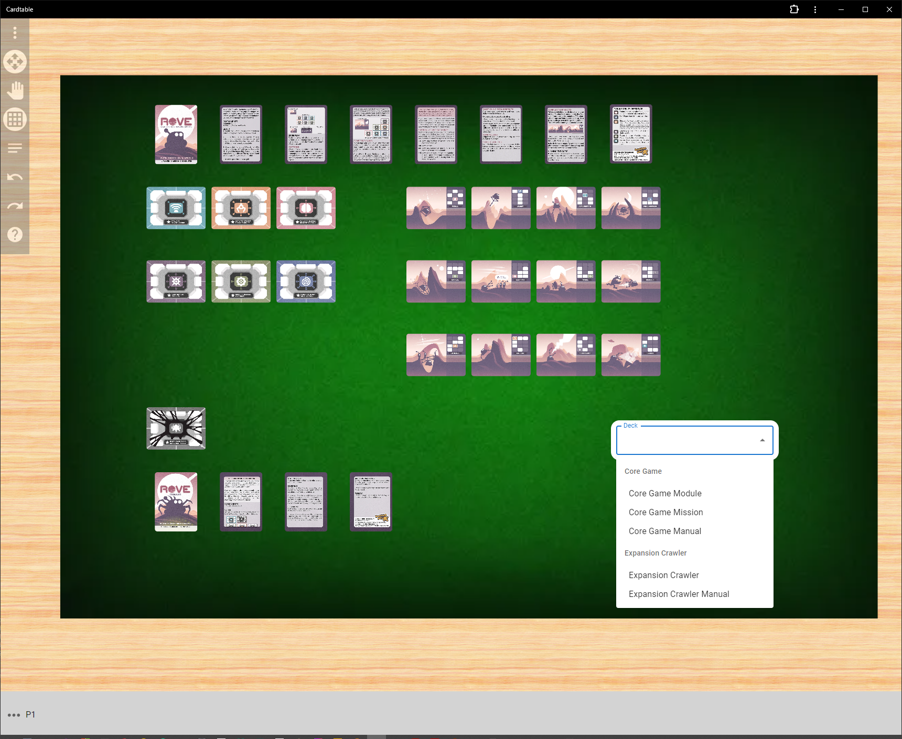

Hi everyone - it's been a while since I've updated this blog, and in that time a lot of things have been added to Cardtable! Let's get to them!

## New games

Since the last blog post, I've added support for a bunch of new games, including the following:

- **Star Wars: The Deckbuilding Game**
  
- **Marvel Legendary**
  
- **Lorcana**
  
- **Star Wars Unlimited**
  
- **Earthborne Rangers**
  

Each of these games had a unique challenge that helped make the Cardtable platform better with each addition. Try some of them out!

## Peeking at cards

A common feature of a lot of cards games is looking at some of the cards on the top of your deck, and then drawing some, putting some back on top, and putting some on the bottom of the deck. Cardtable now supports this in a much nicer way than before!

## Custom content

The most exciting news is that Cardtable now supports custom content!

This is very early stages, so head over to the discord if you'd like to learn more!
