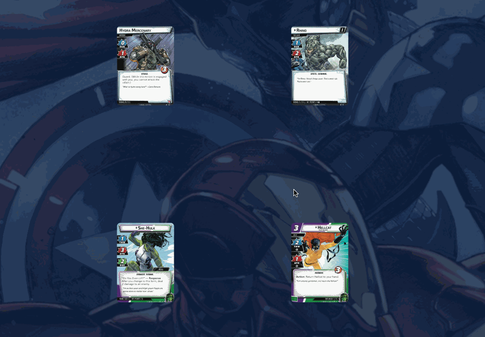
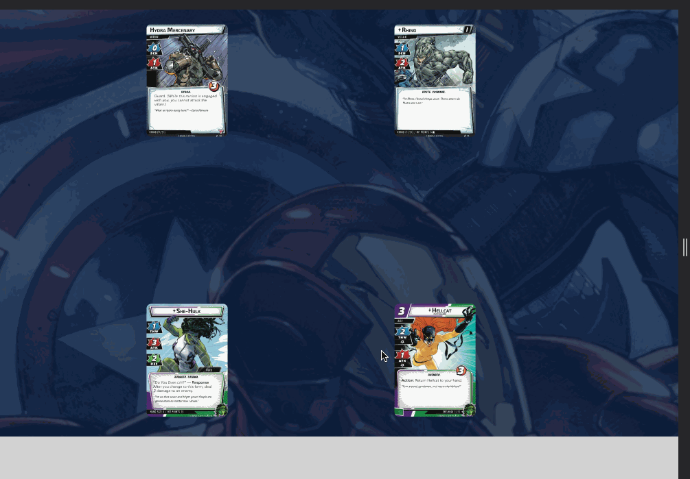

# Arrows

In complex games, you may want to plan out your actions before committing to them. A lot of times, this can be difficult to remember.

Cartable provides the ability to "connect" cards for you to remember using arrows. This is great to plan out, for example, if multiple allies will attack a minion, or who could attack vs defend.

## Drawing an arrow

To draw a new arrow (On Desktop / laptop), hold down the `A` key, and click and drag from the start card to an end card. When you let go, the arrow will stick between the two cards, even if you move one or the other:

On a touch device, select the card stack(s) you want the arrows to start from, then select `Arrow` from the card action menu, then select the card stack to end the arrow:

## Clearing all arrows

To remove all arrows, simply right-click (Desktop / laptop) or select the  menu button, and select `Remove all arrows`
