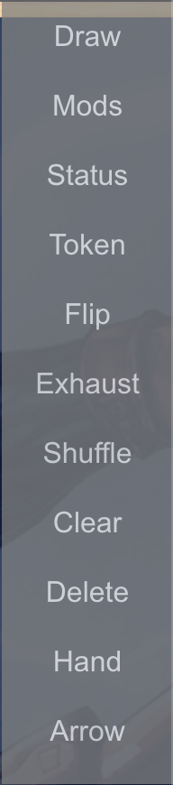
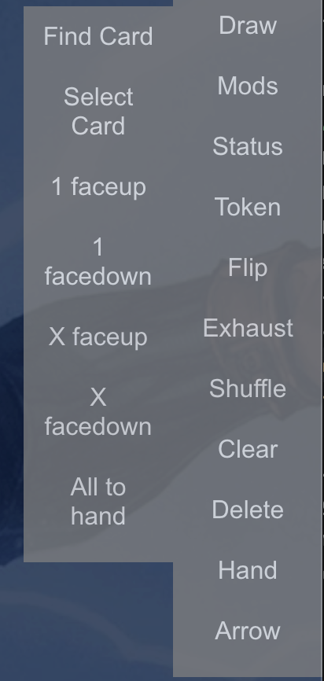
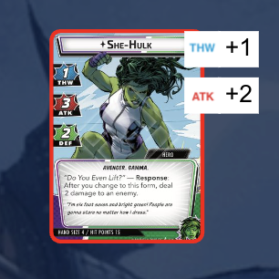
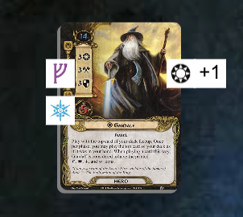
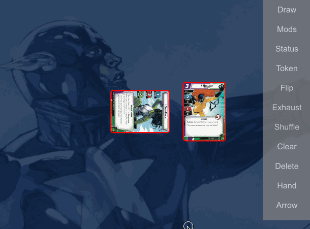

# Card actions

Here are the common actions you will do after you've selected one or more card stacks.

> **_NOTE_** A lot of these operations can be performed either through the on-screen right menu (seen below), or by right-clicking on a card stack (on a Desktop / Laptop) or by keyboard shortcuts (on a Desktop / Laptop)

## Drawing cards off a stack

:::note

When drawing cards off a card stack, they will either go into your hand or on the table, depending on if you have the `Draw into hand` option toggled.

:::

:::tip

**Keyboard shortcut:** _any number key_ will draw that many cards into your hand or faceup on the table

:::

To drag cards off the top of a stack with a mouse / touch, see [this](./cards#pulling-a-card-off-a-stack)

Select the `Draw` menu option, which will give you several suboptions

### Find Card

This will open a box where you can either scroll through all cards in the stack or start typing the name of one. Selecting the card from the list will remove it from the stack and drop it on the table

### Select Card

This is the same as `Find Card`, but doesn't allow you to type in a card name to search. This can be beneficial on a mobile device where the keyboard appearing may obscure much of the screen.

### 1 faceup

Draws the top card of the stack either to your hand or faceup on the table

### 1 facedown

Draws the top card of the stack either to your hand (where it will be visible to you) or facedown on the table

### X faceup

The same as `1 faceup`, but you can select a number from 1-10. That many cards will be drawn

### X facedown

The same as `1 facedown`, but you can select a number from 1-10. That many cards will be drawn

### All to hand

Draws all cards from the stack into your hand - regardless of the global `Draw to Hand` state

## Modifiers to a card stack

In each game, there are certain properties about a card that you may want to note when they are modified. For example, `Thwart`, or `Defense` in Marvel Champions, or Willpower or sphere icons in LOTR LCG. Modifiers will add a reminder of this on the top of your card

 

To adjust a modifier, select the `Mods` option, then the modifier you would like to adjust. At that point you will have a menu when you can either add or remove one from the current value of the modifier, or set the modifier to a constant value.

## Status tokens on a card stack

In each game, there are certain statuses that cards can obtain, such as Stunned or Confused for Marvel Champions, or Committed to the Quest in LOTR LCG. These statuses are usually only "on" or "off" for a card, which differentiates them from numeric tokens.

However, cardtable supports the ability to put an arbitrary number of these statuses on each card.

To add a status, click the `Status` menu, then the status you want to add (ending with a `+`). You can continue to add the status or remove it by selecting the status ending with a `-`.

## Numeric tokens on a card stack

:::tip

**Keyboard shortcut:** There are 3 different types of numeric tokens. To add a token of type 1, 2, or 3 to a card stack, select it and type `Ctrl / Cmd + 1`, `Ctrl / Cmd + 2`, or `Ctrl / Cmd + 3`.

To remove a token of type 1, 2, or 3, select it and type `Ctrl / Cmd + 4`, `Ctrl / Cmd + 5`, or `Ctrl / Cmd + 6`

:::

Numeric tokens are tokens that generally have many on a card during a game, such as Damage or Generic tokens in Marvel Champions or Resource or Progress tokens in LOTR LCG.

To adjust the number of numeric tokens, select `Token`, and then the token type you want to add or remove

## Flipping a card stack

:::tip

**Keyboard shortcut:** The `F` key will flip a card stack

:::

To flip a card stack, select the flip option. This will flip the card stack over, meaning that if you start drawing cards off the "top" of the stack, you will be drawing them in reverse order

## Exhausting a card stack

:::tip

**Desktop shortcut:** On a desktop / laptop, double clicking a card stack will exhaust / ready it

:::

To exhaust a card stack, select the exhaust option. If a card stack is already exhausted, exhausting it will ready the card stack. Note that if you have multiple card stacks selected, they will all operate independently:

## Shuffling a stack

:::tip

**Keyboard shortcut:** The `S` key will shuffle a card stack

:::

To shuffle a card stack, select the shuffle option. This will randomly reorder the cards in the stack.

## Clearing a card stack

To remove all modifiers, status tokens, and numeric tokens from a card, select the clear option

## Deleting a card stack

:::tip

**Keyboard shortcut:** The `Del` or `Backspace` key will delete a card stack

:::

To delete a card stack, select the delete option. This will remove all cards in the stack from the game

## Arrows (advanced)

See [this advanced page](../advanced/arrows) to learn about the arrow command
