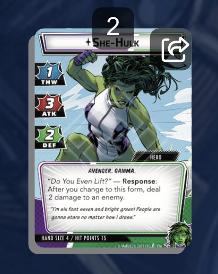
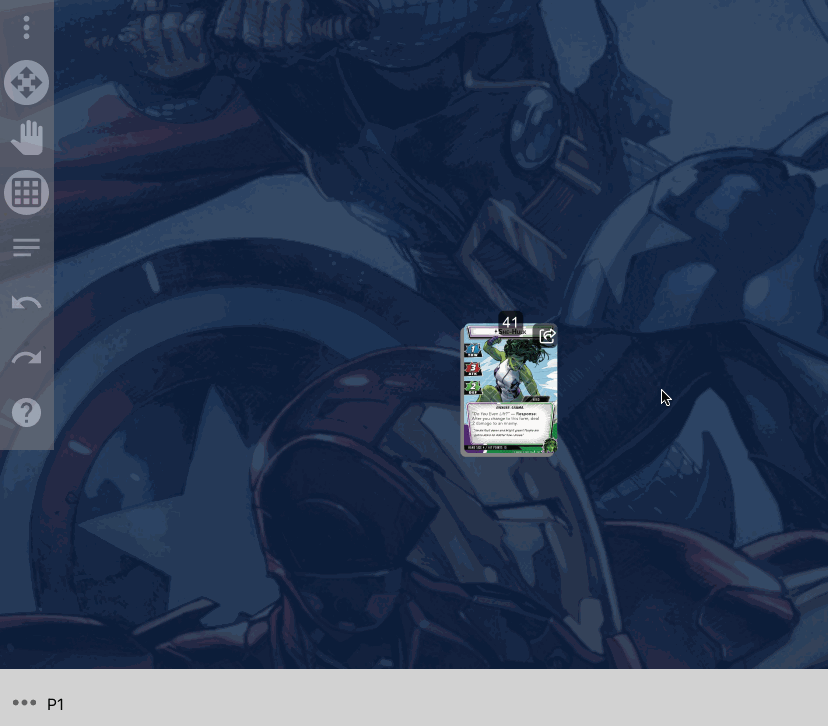

# Cards

Cards are the basic, most used item in cardtable!

## Card stacks

Cards can be stacked, and you will operate on a stack of cards as a single entity, so throughout the documentation I'll refer to "Card Stacks"

You can tell the difference between a single card and a card stack, because the card stack has a slightly more "3d" look:

Single card

Card stack

## Previewing card stacks

To see a more zoomed-in picture of the top of a face-up card stack, either hover over the card (Desktop / Laptop) or double-tap on the card (touch device)

## Selecting card stacks

To select a card, simply click (or tap) on it. You'll know the cards that are selected because they will have a colored border around them.

To select multiple cards, on a Desktop or Laptop:

- Hold Ctrl / Cmd and click on multiple cards
  

On a tablet:

- Toggle on "Multi-select mode", then tap all the cards you want to select.
  

To select many card stacks, you can toggle off "Pan mode", then draw a selection rectangle with the mouse (or finger on a touch device)

After one or more card stacks are selected, a new menu will appear on the right side of the screen to interact with the stack

## Moving a card stack

To move a card stack, simply drag it around the table.

> **_NOTE_**: Be sure to drag the card somewhere _other_ than the upper right corner. Starting a drag from the upper right corner will simply pull the top card off a stack of more than 1 card.
>
> 

## Making a stack

To make a stack of cards, just drag one stack on top of another and release. You'll know you're going to make a stack if the stack you're dropping on top of has a highlighted border

## Pulling a card off a stack

To pull the top card off of a stack, grab the top card in the upper right corner and drag

## Attaching cards

For cards that are closely related to another card, you can "attach" these cards together. After attaching, when moving the base card around the table, all attached cards will move with it. Attached cards will appear to "snap" into place when dropped, and will appear behind, but slightly to the top and right, of the base card.

