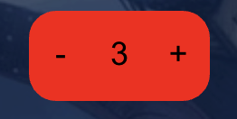

# Counters

Counters are used to track values that go up and down - like health values, for example.

## Creating a counter

To create a counter, right-click on the table (or tap the  menu button on a touch device) and select `Create new Counter`

## Changing a counter's value

To change a counter's value, simply click or tap on the `+` to increment the counter, and click or tap on the `-` to decrement the counter.

:::note
A counter's value cannot go below 0
:::

## Resetting a counter to 0

To reset a counter to 0, right-click on the counter (Desktop / laptop) or long-tap on a counter (touch device) and selet `Reset`

## Changing a counter's color

To change a counter's color, right-click on the counter (Desktop / laptop) or long-tap on a counter (touch device) and selet `Set Color`, then select the color you would like to change the counter to.

## Moving a counter

To move a counter, simply click and drag or tap a drag the counter to the new position
