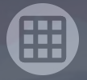

# Menu and Options

Learn about the game table and high level controls

## Changing your view

### Zooming
  To zoom in and out, simly use the scroll wheel on your mouse (Desktop / Laptop) or use "Pinch to zoom" on a touch device.

### Pan vs. Select mode

  If pan mode is selected

  
  
  Then on a Desktop / Laptop clicking, holding, and dragging anywhere other than a card or token will pan the game table. On a touch device, when Pan mode is selected, dragging anywhere other than a card or token will do the same

  If Pan mode is deselected, then clicking and dragging (Desktop) or dragging anywhere other than a card will show a select box so you can select multiple card stacks.

## Draw cards mode

  If "Draw cards into hand" mode is selected

  

  Then when you automatically draw cards off the top of a card stack, they will immediately go into the player's hand. Otherwise they will drop on the table.

## Snap to grid

  If "Snap to grid" mode is selected

  

  Then when you drag a card stack and let go, the stack will "snap" to the nearest drop location. If this is off, the card will go whenever you let go of it.

## Notes

  When you click the "Notes" button

  

  A text box will open where you can enter notes that will be saved (on the current computer only). This is great if you need to leave and game and want to remember what you had just done

## Undo / Redo
  Click the Undo or Redo buttons to undo or redo the last action, respectively