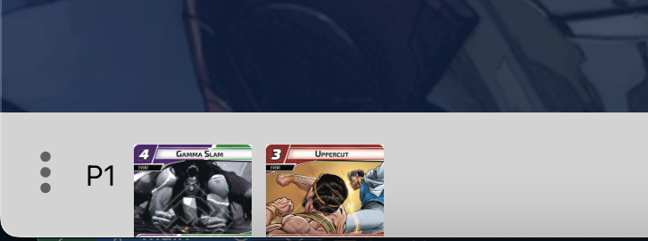
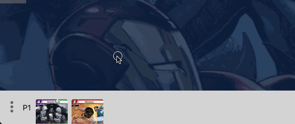
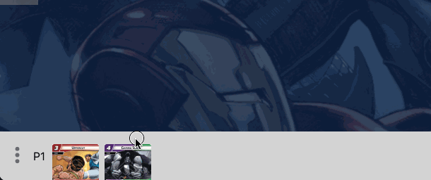
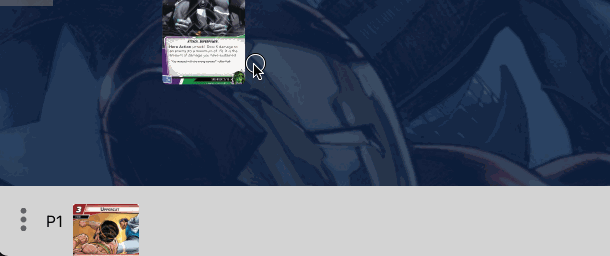
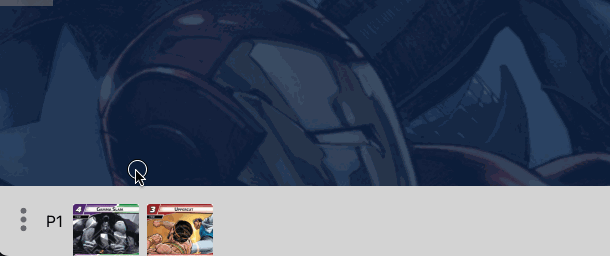
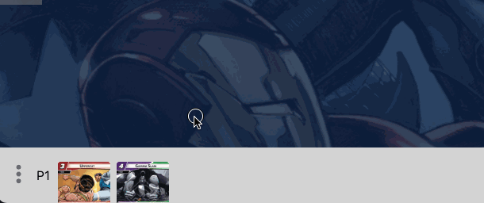

# Player Hand

The Player hand is a special area of the game board that represents the players' hands of cards.

You can reorder cards in your hand

Or drag them onto the table

Or drag them from the table into your hand

You can also drop a random card from your hand on the table. This is great for times when you need to discard a card at random from your hand

Finally, you can switch your current view to any player's hand. Be careful, because any cards you draw when viewing another player's hand will go into their hand!

