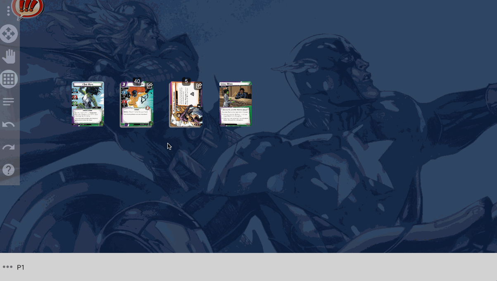

# Multiplayer Basics

:::warning
Multiplayer support is currently in beta. While it has been used successfully, there are many rough edges that need to be worked through. Proceed at your own risk!
:::

One of the technical goals of Cardtable was to be able to play multiplayer games without needing a complicated server. For the most part, this is working in Cardtable, but hasn't been widely tested yet

## Creating a new game

Before anyone can connect to your game, you need to start a new multiplayer game. You can start a new game by opening the main menu (right-click or select the  menu button), and navigating to the `Multiplayer > Start hosting a new online game` entry.

