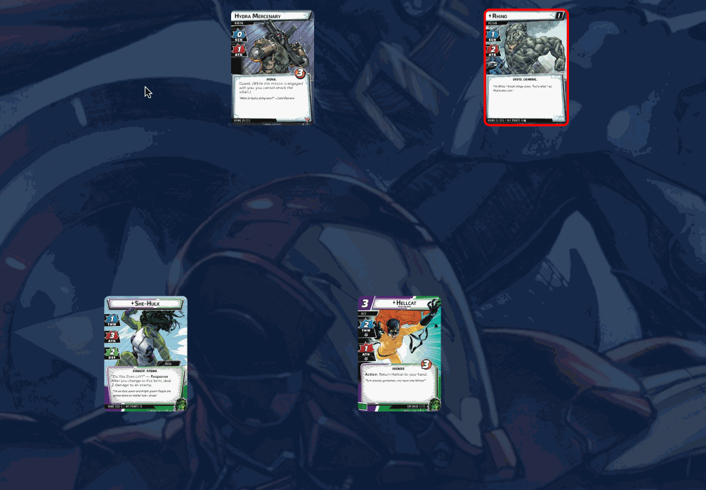

# Multiplayer Basics

:::warning
Multiplayer support is currently in beta. While it has been used successfully, there are many rough edges that need to be worked through. Proceed at your own risk!
:::

One of the technical goals of Cardtable was to be able to play multiplayer games without needing a complicated server. For the most part, this is working in Cardtable, which has some good points and difficulties

Pros

- On the same local network, no extra server is necessary
- Theoretically, there is no limit to the number of multiplayer games that can be happening at the same time

Cons

- Over the internet, an external server is still necessary if one person is behind a NAT firewall
- Because the web browsers are directly communicating, one of them has to be the source of truth, and the games can tend to get out of sync

## Peer Id

Connecting a game is as simple as finding the host's `peer id`. You can see your peer id by opening the main menu (right-click or select the  menu button), and navigating to the `Multiplayer > Peer id is ...` entry.

Clicking on this option will also copy your peer id to the clipboard

:::warning
Currently, every time you refresh the page you get a new peer id. That means, if you are the host of a multiplayer game, and you refresh your page, you will be starting a new game and any other players will no longer be connected. You will need to share your new peer id and have them reconnect to the new game
:::
