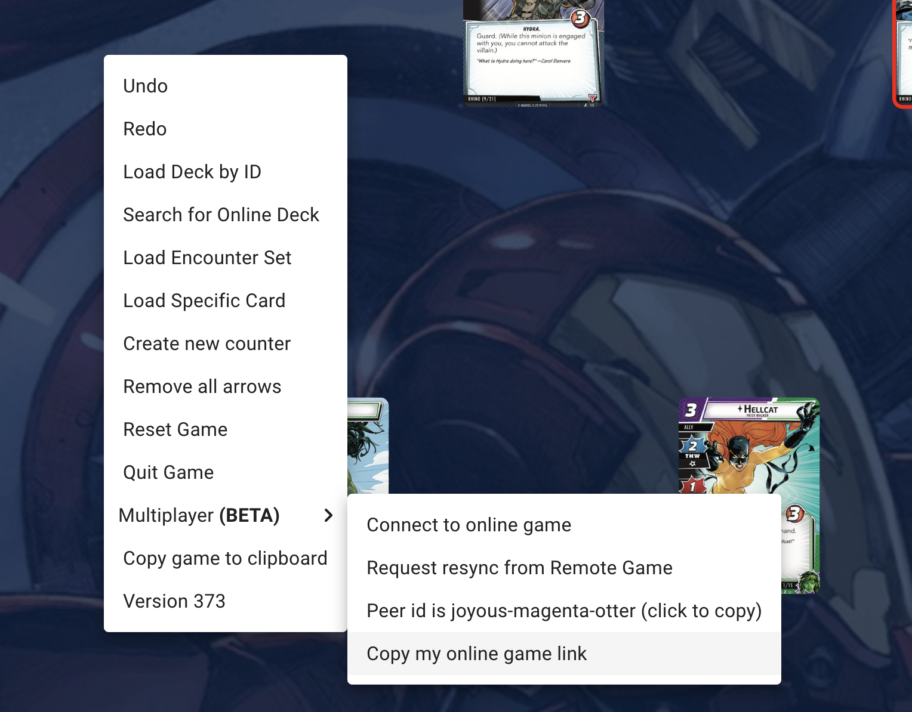

# Playing a multiplayer game

This page will help you with setting up and playing a multiplayer game

:::warning
Currently multiplayer only supports 2 players at the same time
:::

## Hosting a game

Hosting a game is easy! If you are connected to the internet, every time you open the site, you are hosting your own game! You just need to provide your peer id to another player for them to connect

### Sharing a game link

If you would like to share an easy link to allow someone to join your game, right-click or select the  menu button, and select `Multiplayer > copy my online game link`.

Then you can send the link to anyone else, and when they click the link they will be connected to your game!

### Connecting to a game manually

If you would prefer, you can provide your peer id to another player directly. On their instance of cardtable, they can go to `Multiplayer > connect to online game`, which will open a field where they can type in the peer id and click `Connect`

## Playing a multiplayer game

When multiple people are playing the same game, different colored borders will appear around card stacks that the various players are using.

When the other player has a card selected, you are unable to interact with that card.

Certain operations will not affect any other player's game, such as zooming, panning, changing the "Draw to hand" mode, etc

## Resyncing

As mentioned before, there is a chance that the games on the two different browsers get "out of sync". If this happens, you will see a notification at the top of the screen, with an option to resync the game. You can also always do this at any point by selecting `Multiplayer -> Request Resync from Remote Game`

:::warning
If the resync is successful, you will replace your local game state with the state of the other player's game
:::
